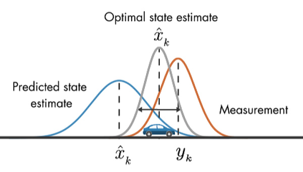
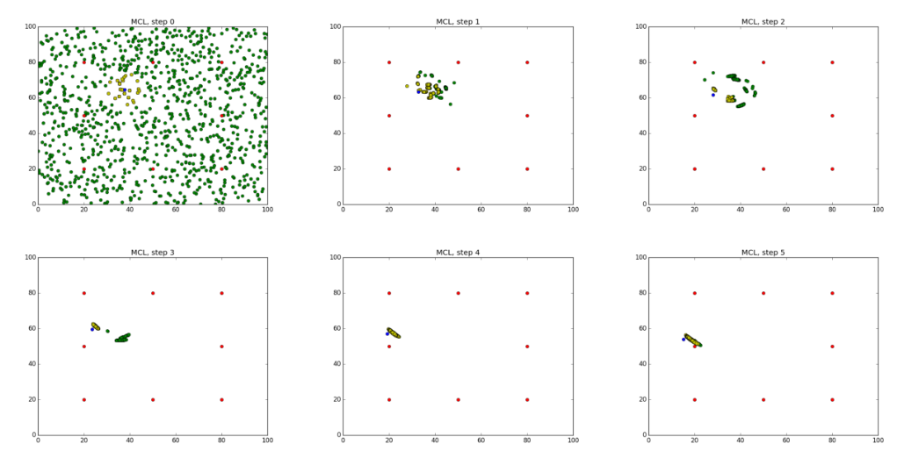
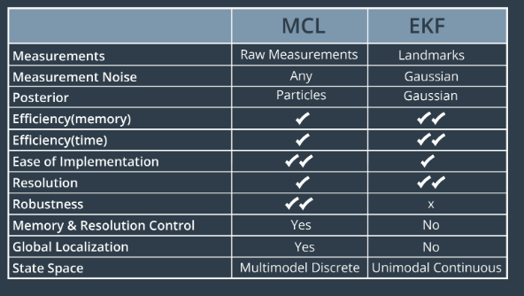
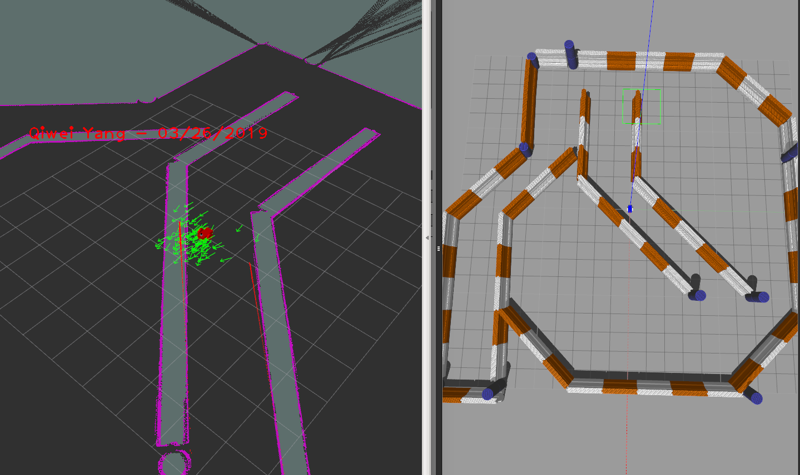
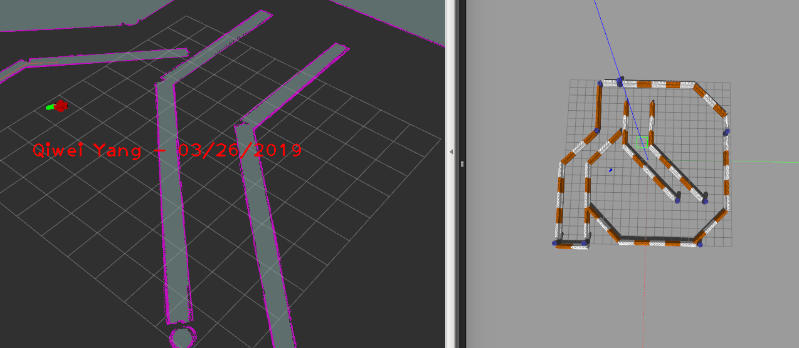
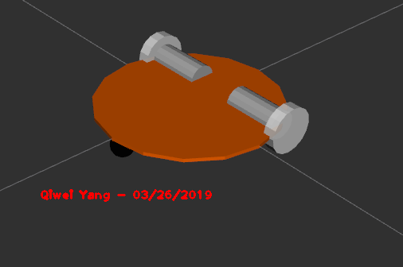

# Robot Localization implementation in ROS

Qiwei Yang

### Abstract

Robot localization is essential to solve robot path planning / navigation tasks. Planning under uncertainties, which are resulted from inaccurate controller, imperfect sensors, 
unexpected environments, etc, is a quite challenging. Accurate estimation of the robot states or poses, which localization aims to accomplish, is critical in decision making under these
uncertainty.
      
There are several powerful algorithms to estimate the robot location, two of which are covered in this project, Kalman Filter and Monte Carlo Localization. ROS community provides packages like AMCL and Navigation
to allow users to easily implement these algorithms in Gazebo simulator.  

## 1. Introduction

There are two key capabilities that a robot shall have when it moves in an environment: Localization and Mapping. Localization means the robot knows the environment or map in advance,
and need to accurately identify where it is continuously when moving, so that it knows if it is approaching the target location in the right direction. Mapping means the robot has no idea about
the environment in advance, but it knows its location and can continuously update the info with confidence, therefore it can map the environment simultaneously when moving. 
Simultaneous localization and mapping, SLAM for short, is a hot research area both in academia and industry. This project deals with localization problem only.    

Localization can be divided into three sub-problems : local localization, global localization, and the kidnapping. In the local localization, also
known as position tracking, the robot knows its initial pose and the problem is to keep track of the robot’s pose as
it moves. In global localization, the robot’s initial pose is unknown, and the robot tries to determine its pose relative
to the ground truth map; the uncertainty for this type of localization is greater than for local localization. In the
kidnapped robot problem, just like in global localization, the robot’s initial pose is unknown, however the robot maybe
kidnapped at any time and moved to another location of the map. Solving for the latter challenge also helps the robot
recover in the event that it loses track of its pose, due to either being moved to other positions, or even when the
robot miscalculates its pose. [reference](https://github.com/csosa27/RoboND-Localization-Project/blob/master/Where%20Am%20I.pdf)

## 2 Mainstream Filters: 

Given only the mean and standard deviation of noise, the Kalman filter is the best linear estimator [refer](http://biorobotics.ri.cmu.edu/papers/sbp_papers/integrated3/kleeman_kalman_basics.pdf). 
Extended kalman filter can be applied for non-linear systems. On the other hand, Monte Carlo method, also called particle filter, can be applied for non-linear systems easily. 
Particle filter is computationally more expensive than Kalman filter, but easier to implement and understand. 

### 2.1 Kalman Filter and Extended Kalman Filter  

#### 2.1.1 Kalman Filter(KF)  
KF in a nutshell:   

A KF is an optimal estimation algorithm mainly invented by Rudolf E. Kalman. Common applications include guidance and navigation systems, computer vision systems and signal processing. It has two major applications:  

1. The variables of interest can only be measurement indirectly.  
2. Several measurements are available from various resources but are subject to noise. 

It is **recursive** so that new measurements can be processed as they arrive.  
  
Specifically in this project, there are two main uncertainties existing in the localization. One is the control or motion uncertainty, the other measurement noisy. In practice, these uncertainties follow the gaussian distribution pretty well.
KF makes use of this property and consider both of them to estimate the location. See the figure below: 

  

[MATLAB reference](https://www.mathworks.com/videos/understanding-kalman-filters-part-5-nonlinear-state-estimators-1495052905460.html)  

"Predicted state estimate" mentioned in the figure is generated from robot motion through controller/actuator, which has uncertainty for sure. For example, the robot may
have unwanted wheel slip, motor inaccuracy, etc. In addition, all measurements have noises, and not perfect. Usually considering their errors generate better estimation than considering only one of them along. 

#### 2.1.2 Extended Kalman Filter(EKF)  

Many practical systems have non-linear state update or measurement equations.
### 2.2 Monte Carlo Localization method (also called Particle filters)  

  

[Matlab MCL introduction](https://www.mathworks.com/help/robotics/ug/monte-carlo-localization-algorithm.html)  
Particle filters
Monte Carlo localization algorithm similar to Kalman Filters estimates the posterior distribution of a robot’s position and orientation based on sensory information but instead of using Gaussians it uses particles to model state.

The algorithm is similar to KF where motion and sensor updates are calculated in a loop but MCL adds one additional step: a particle resampling process where particles with large importance weights (computed during sensor updates) survive while particles with low weights are ignored.

In the MCL example below all particles are uniformly distributed initially. In the following update steps the particles that better match the predicted state survive resulting in a concentration of particles around the robot estimated location.

### 2.3 Filter comparison and summary

   

[referring to Udacity course materials] 

Kalman filter: no need to store all history states, only the previous state information. Can update in real-time, but not optimal for non-linear systems. 

Monte Carlo Localization: Take large memory because it needs to store all history data, good for non-linear systems. 

## 3 Simulation environment

### 3.1 Model creation through urdf/xacro

  

### 3.2 Packages Used

In order to launch the mobile robots, a ROS package was
created. The robot package structure was designed as shown
below. Udacity Bot Package:  

* meshes
* urdf
* worlds
* launch
* maps
* rviz
* config

This robot package, along with the Navigation Stack
and AMCL packages were crucial for a complete simulation
of a mobile robot performing and successfully solving the
localization problem.

  

### 3.3 Parameters

To obtain most accurate localization results, several parameters were added, tested and tuned. The parameter values
obtained for the udacity bot were tuned in an trial-and-error to see what values worked best. 

See the table 1 and table 2 for the summary: 

Table 1  
Global and Local Costmap Parameters: 

|Parameter   |Value | Impact   |
|:---|:---|:---|
| global frame  | map   | The frame does not move in the world  |
| robot base frame  |robot footprint   | The robot's local fixed frame   |
|update frequency   | 15.0   | system warning may occur if too high   |
|publish frequency   |15.0    | system warning may occur if too high    |
|width   |20.0   |The width of the map in meters   |
|height   |20.0   | The height of the map in meters  |
|resolution   |0.05   | same as static map |
| static map  |true   |  incorporates mostly unchanging data  |
| rolling window  |false   | if false, the map is global, otherwise local |

Table 2    
AMCL and Other Parameters: 

| Parameters  | value  | Impact |
|:---|:---|
|min particles   | 10   | Minimum allowed number of particles|
|max particles  |  200 | Maximum allowed number of particles |
| obstacle range  | default = 2.5  | maximum range in meters at which to insert obstacles into the costmap using sensor data|
| raytrace range  | default = 3.0  | maximum range in meters at which to raytrace out obstacles from the map using sensor data|
| transform tolerance   | accuracy  |
| inflation radius  |  0.55  |0.55 meters or more away from obstacles as having equal obstacle cost |
| controller frequency  | 15  |  

At arriving, the robot's confidence regarding its location is much higher than starting, as the robot continuously updated its status through measurements. 
    

## 4 Customized Robot: 

  

## 5 Future Work: 

* I will try to implement these packages on a real robot through Jetson TX2 board. 
* Explore the potentials of AMCL and Navigation packages in more complicated worlds. 

[article reference](https://medium.com/@fernandojaruchenunes/udacity-robotics-nd-project-6-where-am-i-8cd657063585)  

[kalman filter, matlab](https://blogs.mathworks.com/headlines/2016/09/08/this-56-year-old-algorithm-is-key-to-space-travel-gps-vr-and-more/)  

[Robot mapping] (http://ais.informatik.uni-freiburg.de/teaching/ws13/mapping/pdf/slam04-ekf.pdf)  

[biorobotics kalman filter](http://biorobotics.ri.cmu.edu/papers/sbp_papers/integrated3/kleeman_kalman_basics.pdf)  

[CMU kalman filter] (http://www.cs.cmu.edu/~16831-f14/notes/F10/16831_lecture20_21_zlamb_jlibby/16831_lecture20_21_zlamb_jlibby.pdf)  
